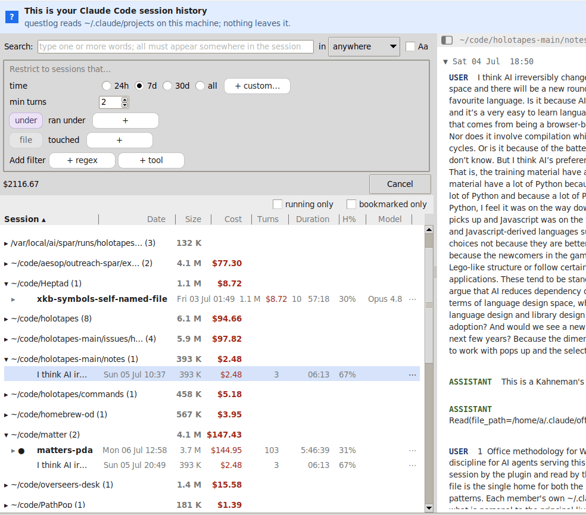

# questlog

In a role-playing game, the quest log is the screen you open when you cannot remember what you were doing: every quest listed with its objective, its cost, and a way to pick it back up. questlog is that screen for your Claude Code sessions.

A native GUI for finding, reading, and resuming past Claude Code sessions stored under `~/.claude/projects/`, on Linux and macOS. It offers a session list grouped by project, a typed search that streams matches across all projects as snippets under each session, a docked viewer that segments long conversations into sections, and right-click actions that resume a session in its original working directory.

questlog reads `~/.claude/projects` on this machine; nothing leaves it.



## Typical problems it solves

The tool exists for the moments you go back to a session after it is finished, above all the returns you could not have prevented by writing notes at the time.

- You quit a session and days later realise you never acted on its result, the email unsent, the commit unmade, which was the point of running it. The finished session is the only record of what was decided.
- A figure or conclusion from a session is challenged later, and you need to go back and check its source and reasoning.
- You cannot recall which project a conversation lived in, and grep-by-memory fails because what you typed was "ok now do the thing". The pile has grown past where `ls -lt` and scrolling still work.
- You want the session that last touched a particular file, and the reasoning around the change.
- You need a past session read as a conversation, not as a wall of thousand-character JSONL lines.
- You renamed a project folder and its sessions vanished from `/resume`, or you simply want them grouped and moved without loss.
- You run several sessions across terminals and cannot tell which is working and which is waiting for you.

## Scope

A single-user desktop tool that reads the local JSONL Claude Code already writes, and nothing more. It runs natively on Linux and macOS, with no Electron and no embedded web view, which on Linux is the gap the official Desktop app leaves. It reads files on the local machine only, and Claude Code sessions only, not other agents.

Deliberately out of scope, because separate tools already serve them: exposing session history to the running agent over MCP, orchestrating parallel sessions, and unifying history across devices or across the CLI, Desktop, and web clients. questlog is a way back into a finished session, not an orchestrator.

## Window layout

The window opens as a horizontal split: the **session list** with its toolbar on the left and the **reading view** on the right, a status bar along the bottom. The reading view is present from launch, showing a centred empty state until the first session or snippet is clicked.

The **toolbar** holds a time window (24 h / 7 d / 30 d / all, or a custom relative span or calendar date), a search box with a case toggle and a scope (anywhere, the said text, tool calls, or tool output), and a small form of AND-joined criteria with a "this cwd only" filter that auto-detects whether the launch directory has a corresponding project folder. The persistent **folder** and **file** rows ask which folder a session ran under and which file it touched; each file carries an operation pill (read, wrote, or either), so one criterion answers "which session touched this file" without caring whether it was a Write or an Edit, matched by path suffix so a bare filename finds it in any directory. A short tail reveals the rarer **regex** (a raw content pattern) and **tool** (a session that used a given tool) rows on demand. A session is shown only when it satisfies every criterion somewhere in its log.

The **session list** is one widget doing two jobs. With no search active it browses your sessions grouped by project, each marked while it is running and when you have bookmarked it. Type a word or add a criterion and the same list narrows to the sessions that match, showing the matching evidence under each so you can tell which one you want before you open it. A click opens a session in the reading view.

The **reading view** on the right is filled by the first click. A single click on a session header or a snippet renders the whole jsonl, then anchors it to the relevant line, so the view never grows or jumps as it loads. It splits a long jsonl at compaction-boundary records and at idle gaps over ten minutes, presenting each segment as a section. `Ctrl-F` opens an inline find within the session.

Right-clicking a session offers "Open in viewer", "Copy resume command", "Copy session id", "Copy session path", "Copy last assistant output", "Resume in new terminal tab", "Resume forked", "Move to...", "Reveal folder", and "Add/Remove bookmark". A session can also be moved by dragging it onto another folder heading. The terminal launcher detects `gnome-terminal` / `konsole` / `ptyxis` / `xterm` and uses the right `--tab`-style invocation.

## Design principles

**The filesystem is the source of truth.** Session logs sit on disk with mtimes the kernel maintains for free. Any picture of "what sessions exist" we keep elsewhere is older than what the filesystem already reports. The tool reads the filesystem at the moment it needs an answer, rather than holding a separate model of it that has to be kept in sync.

**Read what is needed at the moment it is needed.** The toolbar's default seven-day window covers a few thousand files. Reading each one with a line-streaming regex, stopping at the second user record, takes under a second in serial. The full corpus of ten thousand files takes two seconds. There is no work budget here that demands amortisation across launches.

**Memoise within a process, not across launches.** Once a file's row has been computed in this run it is reused for subsequent toolbar window changes. Shrinking the window filters in memory; growing it scans only the new files. The accumulated state lives for the lifetime of the GUI process and is discarded on quit. A user resuming a session in another terminal sees the change on the next launch, not via a watcher or a sync protocol. This covers the session model; the only state kept across launches is a single first-run flag under `$XDG_STATE_HOME/questlog`, recording that the welcome banner was dismissed, which holds no session data.

## Installing

Packages are on the [releases page](https://github.com/overseers-desk/questlog/releases).

```
sudo apt install ./questlog_<version>_all.deb        # Debian / Ubuntu
sudo dnf install ./questlog-<version>-1.noarch.rpm   # Fedora / RHEL
```

On macOS, through Homebrew:

```
brew tap overseers-desk/od
brew install questlog
```

A single-file executable is also on the releases page; [docs/installation.md](docs/installation.md) covers it and the Tcl 9 runtime it expects.

## Running

```
./questlog                                        # launch the GUI
./questlog tool:edit lib/scan.tcl                 # launch pre-seeded with a file (edited) criterion
./questlog tool:edit foo.tcl pattern "bar"        # several criteria, AND-joined
./questlog -regex "pattern"                       # prefill a single pattern criterion
./questlog --search "california michael"          # prefill the search bar (plain words, not regex)
./questlog --since 30d                             # open on a time window other than the 7d default
./questlog --since 2026-04-01                      # ... or on everything since a calendar date
```

`./questlog` opens the main window immediately and streams rows in. The default seven-day window populates in under a second; switching to "all" extends incrementally with the tree growing as files are scanned. Scan progress is reported in the bottom status bar.

A leading criterion token on the command line pre-seeds the GUI with a criteria chain: arguments pair as `<type> <value>`, where type is `tool:read`, `tool:write`, `tool:edit`, `tool:file`, `tool:<name>`, or `pattern`. The type tokens and the flags accept an optional leading `-` or `--`, so `tool:file`, `-tool:file`, and `--tool:file` are the same (the last matches the spelling the command-line mode uses). The `tool:` file selectors match the recorded file path by suffix (the GUI shows write and edit together as `wrote`); `tool:<name>` matches a session that used that tool, with the value found in its invocation; `pattern` matches content. The GUI then behaves normally, including the time-window control, so widen the window from the default 7 d when hunting an older edit. Like any GUI invocation, this needs an X display. The older `-regex PATTERN` flag still prefills one pattern criterion. An argument the seed grammar does not recognise is reported as a usage error, rather than dropped.

## License

[MIT](LICENSE).
